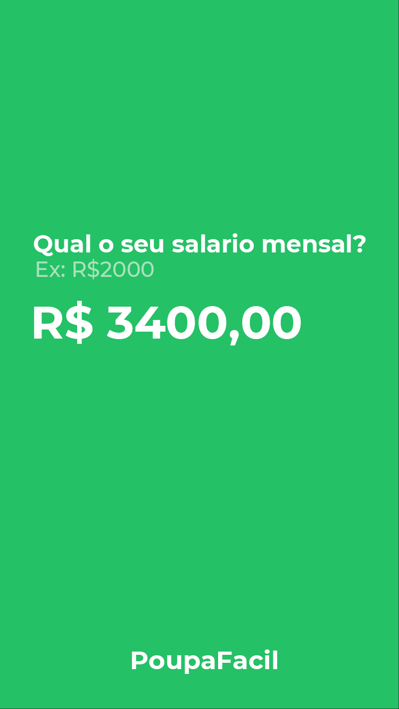
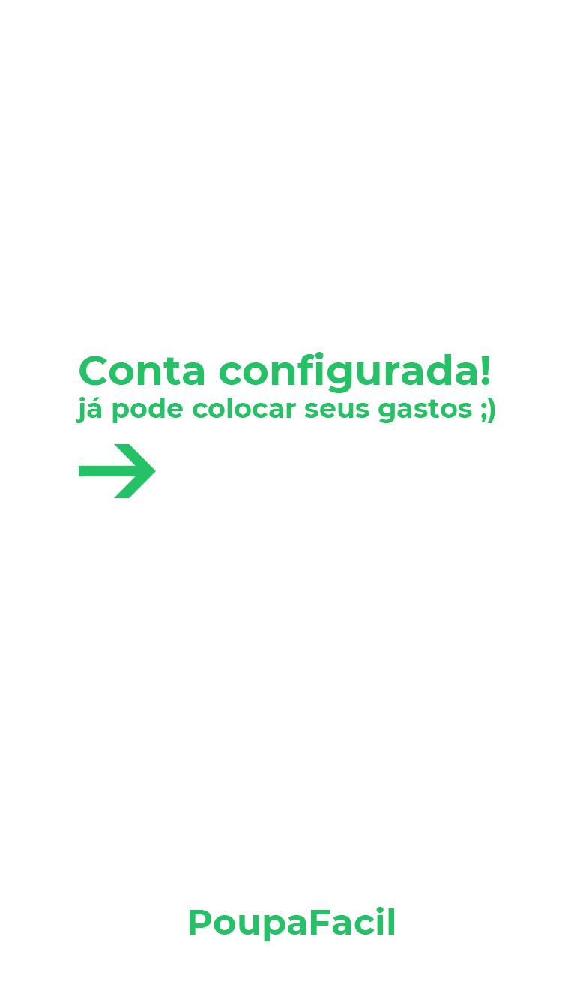
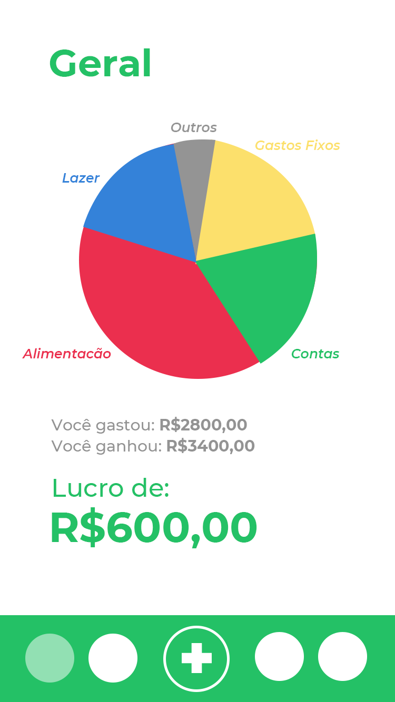
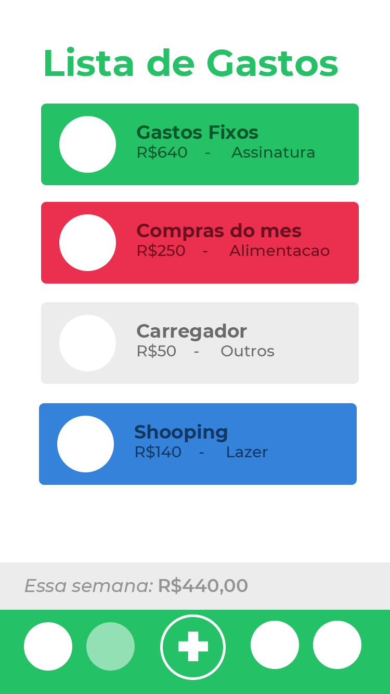
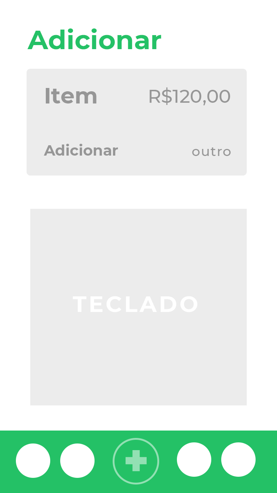
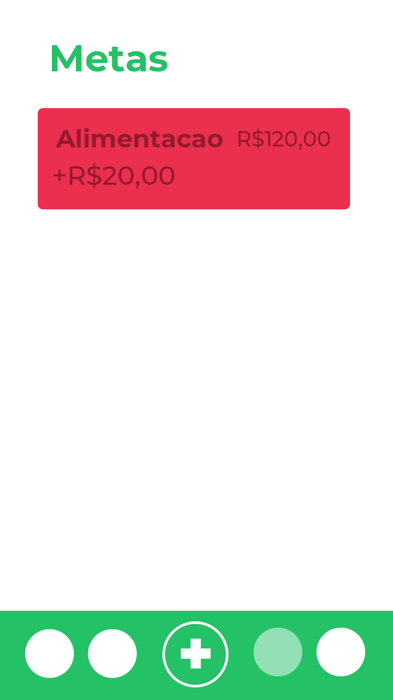

<h1 align="center">
 
  
 
 
<!--PoupaFacil-->
</h1>

App de administração de gastos e ganhos financeiros

<!--

  

-->

## Login / Criação de Conta

  
  
  

## Interface de Usuário

  
  
  
  

## Features
Todas as funções e usos do app
- 📄 **Listagem de gastos**
- ⚠️ **Notificacao de imprevistos**
- ✅ **Calculo automatico de ganhos e perdas**
- 📊 **Metas de gastos mensais**

## Para quem?
Pessoas que querem cortar gastos ou ter uma melhor administração dos mesmos  

## Renda
❇️ **ASSINATURA PREMIUM** ❇️

## Porque o usuario assinaria?
Um dos pilares da vida e bem-estar é o **dinheiro**  e se o aplicativo vai te **ajudar a salva-lo** ele e um **investimento**.  
A quantidade de dinhero que voce economiza cobre os gastos da assinatura!

## Desenvolvimento:
- Programação frontend app mobile
- Programação backend app mobile
- Hospedagem (server) (para registro das contas / informacoes / pesquisas)
- Experiencia de usuario (local de interface forma de cadastro)
- Design UX do app mobile
- Criação da marca (Registro juridico)
- Design da marca (Logo / Identidade visual)
- Criação de anuncios e propagandas / estrategia de engajamento
- Marketing e Tráfego de anuncios

<!--## License
This project is licensed under the MIT License - see the [LICENSE](https://opensource.org/licenses/MIT) page for details.-->
